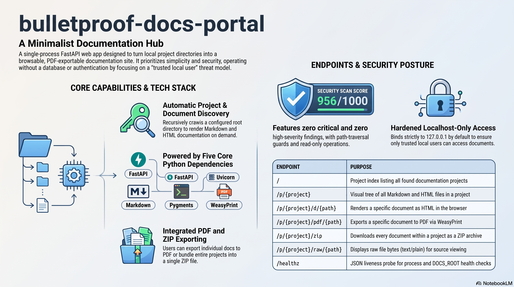

# bulletproof-docs-portal

Minimal local web app to browse and PDF-export project documentation
across all projects under a configurable root directory (`DOCS_ROOT`).



## What it does

- Walks the directory set by `DOCS_ROOT` and lists every project that has docs
- For each project, shows a tree of all `.md` and `.html` files
- Click a doc → renders as HTML in your browser
- "Download PDF" button on every page
- "Download all as ZIP" per project
- No auth, no database, no compliance service. One process.

## Run

```bash
cd bulletproof-docs-portal
python3 -m venv .venv
.venv/bin/pip install -r requirements.txt
.venv/bin/uvicorn app:app --host 127.0.0.1 --port 8090
```

Open http://localhost:8090

## Configure

```bash
DOCS_ROOT=/path/to/projects .venv/bin/uvicorn app:app --port 8090
```

## Native deps for PDF export

WeasyPrint needs Cairo + Pango. On macOS:

```bash
brew install cairo pango gdk-pixbuf libffi
```

On Debian/Ubuntu:

```bash
sudo apt-get install libcairo2 libpango-1.0-0 libpangoft2-1.0-0 libgdk-pixbuf-2.0-0
```

## Documentation

- [Overview](docs/OVERVIEW.md) — what it is and how it works
- [Install](docs/INSTALL.md) · [How to use](docs/HOW-TO-USE.md) · [Administrator guide](docs/ADMINISTRATOR.md)
- [SBOM](docs/SBOM.md) · [Security scan report](docs/scan/scan-report.md) — score 956/1000, 0 critical / 0 high

## Media

A NotebookLM-generated overview set lives in [`media/`](media/): a briefing document
([`media/system-overview.md`](media/system-overview.md)), an explainer video
([`media/system-overview.mp4`](media/system-overview.mp4)), and a slide deck
([`media/bulletproof-docs-portal-deck.pdf`](media/bulletproof-docs-portal-deck.pdf)).
The overview infographic is
[`docs/media/infographic.png`](docs/media/infographic.png).

## License

Apache-2.0 — see [LICENSE](LICENSE) and [NOTICE](NOTICE).
